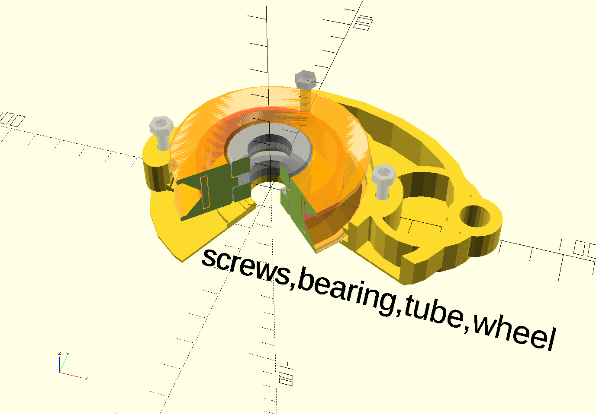

# Constructive Library: Ceate complex and simple models in OpenScad with expressive and less mathematical code
(A dialect of OpenScad more suitable for complex models, with many new features. It has been in continous use by myself for few years now)

#### Compiles directly by OpenScad. No other tools needed. Just include the:
_constructive-compiled.scad_ in your .scad file, that is all.

----

#### For an conceptual introduction
look at the the [Part II tutorial](./tutorial-partII.md)

#### For a very basic introduction for people new to openscad
see the [beginners tutorial](./tutorials/basic-tutorial.md)

there is also a commented example in pulley-demo.scad:

The Constructive Library (about 1900 lines of Code)
introduces a different approach to OpenScad Syntax: you rarely need difference(), for(),intersection() or their one-to-one equivalents, In the library's own dialect a for() block might look like:

pieces(4)  X(every(35)) turnXY(vals(10,25,-15,40))  cube(10);

It is all valid OpenScad, you do not need any additional programs, just the OpenScad and the constructive-compiled.scad file.

The Constuctive-Syntax tries to align more with mechanical construction of parts and less with mathematical concepts like arrays, vectors and functions. (but they are heavily used behind the scenes). So it aims to be more concise and fluent for mechanical parts than vanilla OpenScad. It allows you to make holes from Modules and really good deal more.
For about 5 years now i have been working on it and using it a lot. Now I i hope you will find it just as useful, as i do. I am barely writing any vanilla OpenScad any more.

If somebody likes the Ideas, you are welcome to join work on it. It is released under GPL2, and I appreciate additions/discussions/collaboration. Perhaps, some Ideas can be used by the OpenScad itself.

> The easiest way to try out the Library is to download the [kickstart.zip](https://github.com/solidboredom/constructive/blob/main/kickstart.zip)
> and then extract both files contained in it into same folder. Then you can open the tryExamples.scad from this folder with OpenScad, and then use this file to try the code Examples from the Tutorial, or anything else you like. Just Pessing F5 in Openscad to see the Results.

For an conceptual introduction
look at the the [Part II tutorial](./tutorial-partII.md)

for a very basic introduction for people new to openscad
see the [beginners tutorial](./tutorials/basic-tutorial.md)

For a more advanced use look at the explanations inside the example below, or ask me directly.

https://github.com/solidboredom/constructive/blob/main/examples/mount-demo.scad

there is also another Example at:

https://github.com/solidboredom/constructive/blob/main/examples/pulley-demo.scad

There are many more features useful for complex models, like its own minimalistic type-subsystem,

basic inheritance of construction parts (still needs improvement), or inverse transformations like in :

g(X(10),Y(15),turnXY(45),X(30))

    g(backwards([X(10),Y(15),turnXY(45),X(30)])

        box(10);

Try it! i hope you will find it as useful as i do.

Peter

