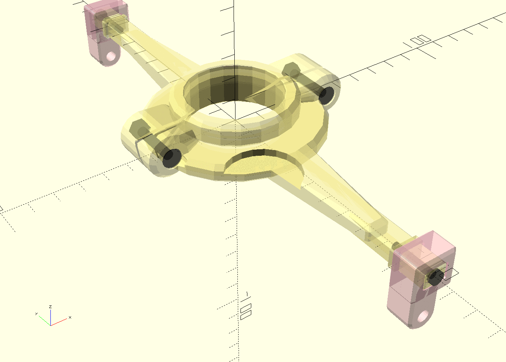

# Constructive Library: Ceate complex and simple models in OpenScad with expressive and less mathematical code

Easily create holes from modules and overcome many Openscad's limitiations for complex models using the library's own syntax. 

*Compiles directly by OpenScad*. No other tools needed. Just include the:
_constructive-compiled.scad_ in your .scad file, that is all.

----



Constructive Library (about 1900 lines of Code)
introduces a different approach to OpenScad Syntax: you *rarely need difference(), for(),intersection()* or their one-to-one equivalents, In the *library's own dialect a for()* block might look like:

pieces(4) X(every(35)) turnXY (vals(10,25,-15,40)) cube(10);

It is all *valid OpenScad*, you do not need any additional programs, just the OpenScad and the constructive-compiled.scad file.

The Constuctive-Syntax tries to align more with mechanical construction of parts and less with mathematical concepts like arrays, vectors and functions. (but they are heavily used behind the scenes). So it aims to be more concise and fluent for mechanical parts than vanilla OpenScad. It allows you to make holes from Modules and really good deal more.

For a **basic introduction** (specially if you are new to Openscad )
see the [beginners tutorial](./tutorials/basic-tutorial.md) it explains Constructive Syntax for main Building blocks, like tube(), box() or bentStrip() and their placement and alignment in space like stack() , align(),  X(),Y(),Z() or turnXZ() 

[Part II tutorial](./tutorials/tutorial-partII.md) shows somee basic object modification like reflectX(), cScale() ,or colors and then goes on to explain, how to work with sets of similar objects without for(), with: pieces(), span(), vals(), selectPieces(), etc..

[Part III tutorial](./tutorials/tutorial-partIII.md) shows more advanced Features like grouping commands into a g() group, working with Parts, and combinig them into Assembly 

For a more advanced use also look at the explanations inside the example below

https://github.com/solidboredom/constructive/blob/main/examples/mount-demo.scad

there is also another Example at:

https://github.com/solidboredom/constructive/blob/main/examples/pulley-demo.scad


The easiest way to try out the Library is to download the [kickstart.zip](https://github.com/solidboredom/constructive/blob/main/kickstart.zip)


Still uncovered are inverse transformations like in:

g(X(10),Y(15),turnXY(45),X(30))

```
g(backwards([X(10),Y(15),turnXY(45),X(30)])

    box(10);
```

also part inheritance, part selector prefixes, internal type Ssystem and some more features

Try it! i hope you will find it as useful as i do.

Peter
