# introduction to Openscad with the <u>Constructive</u> library for a new openscad user

### PART II

--------------------

if you are unsure about particular basic commands used in the codes snipplets below, please refer to the [basic tutorial](./basic-tutorial.md).

> NOTE: To run all code examples from this tutorial you will need only Openscad and
> a single file: constructive-compiled.scad put in the same Fodler as your own .scad files.
> the easiest way to start is to download the [kickstart.zip](https://github.com/solidboredom/constructive/blob/main/kickstart.zip)
> and then extract both files contained in it into same folder. Then you can open the tryExamples.scad from this folder with OpenScad, and then use this file to try the code Examples from the Tutorial, or anything else you like. Just Pessing F5 in Openscad to see the Results.

---

### body transformations

#### reflectX(),reflectY(),reflectZ(),scale()

TODO: still need to add descritpion text here
---

---

### Body duplication, "life without for()"

to create several similar bodies or say a sequence of holes in one object,
usually do not need to use for() and index variables, like in vanilla OpenScad. The command you use instead are less general, allowing to expressthe intent of what you trying to acheive in less code shorter and make it easier to understand:

### pieces(n) and every(distance)

when you need to create n similar bodies, instead ofusing valnilla openscad's for() you would use
pieces(n), so lets say we want to create 7 boxes (with side 10),and moving each up by 20 mm,
very short simple,no need to use variables:

```.scad
include <constructive-compiled.scad>

pieces(7) X(every(20)) box(10);
```

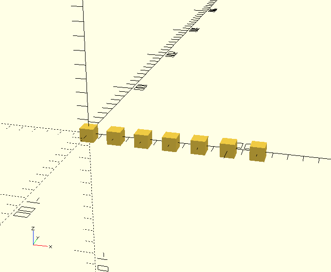
----

we can also make boxes all different, say increasing their height by 5 each

```.scad
include <constructive-compiled.scad>
pieces(7) X(every(20)) box(10,h=10+every(5));
```

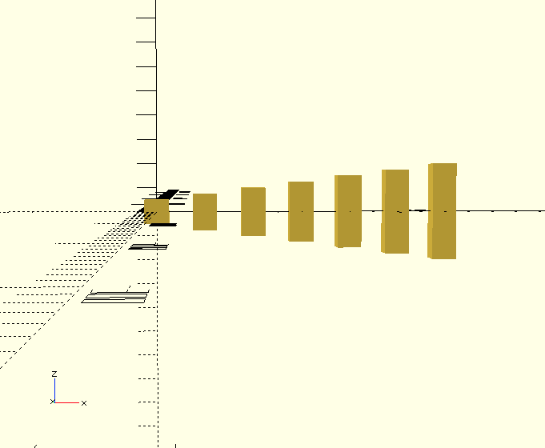

---

#### sides(distance)

sides is useful to create two symetrically placed or mirrored bodies

because "there are always two sides" sides() need to always be preceeeded by  piecees(2) or by_two()_ which is ashort for _pieces(2)_

sides() will always return -1 for the fist piece and 1 for the secnd piece
if you use it with an argument like: sides(arg) it will return -1*arg for the first piece and 1*arg for the second:

```.scad
include <constructive-compiled.scad>

two() X(sides(15)) ball(10);
```

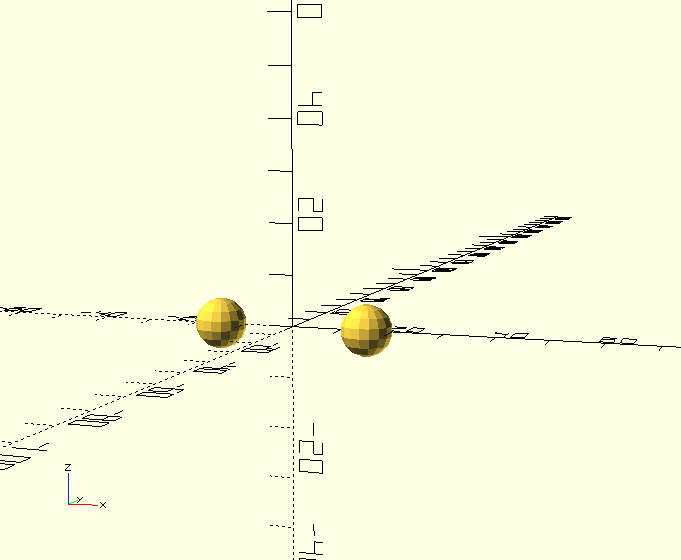
----

```.scad
include <constructive-compiled.scad>

two() X(sides(15)) turnXZ(-sides(30)) box(10);
```


---

or you can use relflectX() to acheive the same result, mirroring the right and left Parts

```.scad
include <constructive-compiled.scad>

two() reflectX(sides()) X(15) turnXZ(-30) box(10);
```

so it produces the sameresult as above


---

#### span(range) and pieces(n)

sometimes you do not want to figure what wouldbe the distance between neighbours you need to pass to every(distance) to say span 650 mm by 8 pieces, then it is handies to use  span(range) than every(distance).

span(_range_)  preceeded by pieces(n) can (among other uses) be used to fill a range with arepetative body.

include <constructive-compiled.scad>

pieces(8) X(span(100)) turnYZ(span(90)) box(10);

used iside of a pieces(_n_) block to automatically calculate values for each call, so that the  _n_ values will evenly cover the  whole _range_. it is like using a for(), but the step is determined automatically alonglines of step = range/pieces

for example:

```.scad
include <constructive-compiled.scad>

pieces(5) X(span(100)) box(10);
```

will fill a range of 100mm with box of side 10
  

> NOTE: 100mm is measured between centers of the boxes, the whole space taken up will be (range + boxsize) which is in our case 110 mm

```.scad
include <constructive-compiled.scad>

pieces(8) X(span(100)) turnYZ(span(90)) box(10);
```

 will cleate 8 boxes with their centers filling a range of 100 mm andeach one turned in YZ axis by an appriate angle picked from the [0:90] range
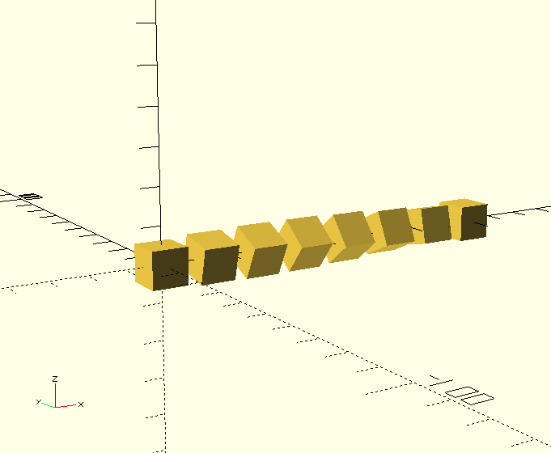  

> NOTE: pieces(_n_) span(_range_) will put a body or run _n_ times to span all the _range_. including the upper range limit. For example the pieces(3) turnXY(span(180)) X(20) box(10); above, will put a box each at 0°,90°a and 180° degrees, which is what you most probably want.
> But if you want to have  full circle (360°) range or run it from an outer for() you will need to use

#### spanAllButLast(range) vs span(range) differences

instead of span(range)
it works just the same like span() but does not put an element at the very end of the range,placing all elements closer together to leave a space at the end for just another element. you might use it when you use  pieces(n) to span full closed circle(360°), For Example:

```.scad
include <constructive-compiled.scad>

pieces(3) turnXY(span(180)) X(20) box(10);
```

 will cleate 3 boxes at 0,90 and 180 degrees, which is just fine
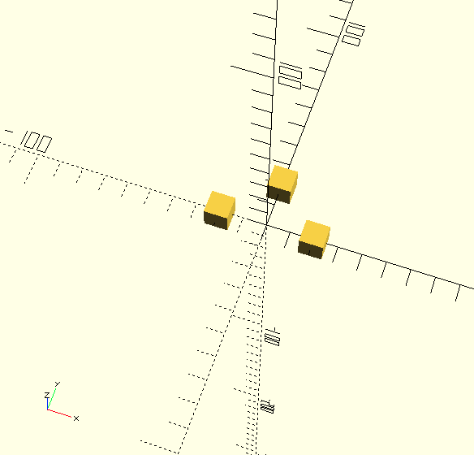

,but the:

```.scad
include <constructive-compiled.scad>

pieces(3) turnXY(span(360)) X(20) box(10);
```

will create 3 boxes, each one at at  0°, 180° and 360° degrees, the the 0°  and 360° is the same Angle, so the first and the last box are drawn at the same position, so there will be only two discenable boxes visible, which is most probbly not what you want.  
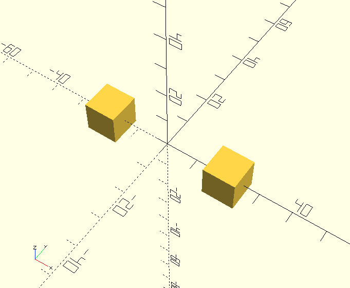

what you probably wanted i n this case to put boxes at positions 0°, 120°, 240° so there are thee boxes visible, and thefirst nand last one are not drawn at the same postion like above.

```.scad
include <constructive-compiled.scad>

pieces(3) turnXY(spanAllButLast(360)) X(20) box(10);
```

will do just exatly that, so use it when you want to span 360°,


To further illustrate the difference, look at the following example spanning 100 mm (between centers) :

```.scad
include <constructive-compiled.scad>

pieces(5) X(span(100)) ball(10);
```


and the following, placing the balls closer to each other, to leave a space for a just one more ball at the end. This one will be useful when using pieces(n) ...span(range) . within another for() "cycle". so that the first element in the next for() iteration could take the space left for the last one    

```.scad
include <constructive-compiled.scad>

pieces(5) X(spanAllButLast(100)) ball(10);
```

will produce:

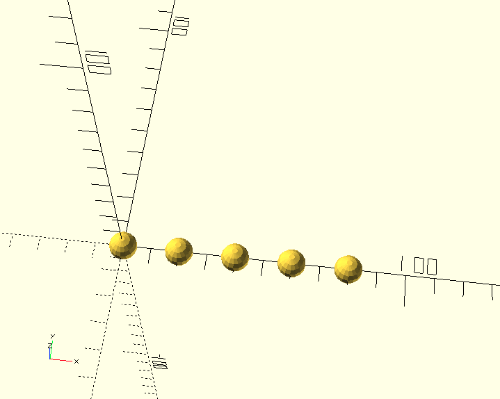

----

> NOTE: that

```.scad
spanAllButLast(range)
```

is same as

```
span(n,allButLast=true)
```

----

#### specific value for each piece: vals(val1,val2,val3,...)

```.scad
include <constructive-compiled.scad>

pieces(6) X(span(120)) Z(vals(10,20,40,15,25,35)) ball(20);
```

this will pick one value from the list of arguments of vals(10,20,40,15,25,35) for each peace,
 of course you will need to provide enough values, so each peace gets one  
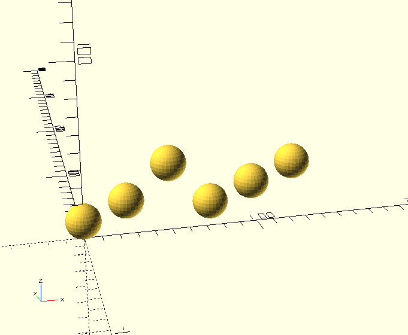  

---

wrapping the vals() function grouping command g() (explaned later) will also allow you to use movement or turning commands themselves as single values in the value list:

```.scad
include <constructive-compiled.scad>

pieces(3) g(vals(X(20),X(40)*Y(20),turnXY(45)*X(100)))
  color(vals(red,green,blue))
    ball(15);
```

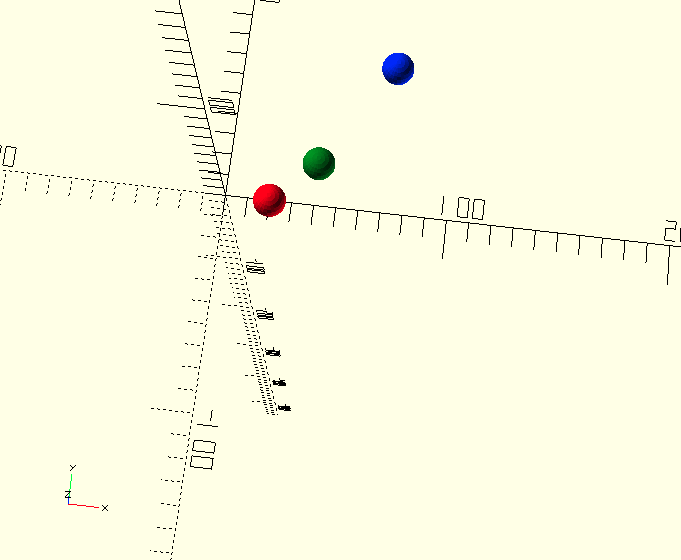  

> NOTE: the asterisk '*' is used to connect several different commands into a single value,which will be used for one piece of the pieces(3). Behind the scenes, movement or turning commands are represented as matrices so multipling arbitrarary number of such command to another ones will result in  a new matrix, which represents a command containing all the transformations from each command multiplied   

### vRepeat(val1,val2,...)

when using the vals() function you need to provide a value for each piece created.
vRepeat works almost the same, but if you have more pieces than values, like say: pieces(15) and only 4 values (10,20,30,40) the vRepeat will use all (in our case 4 ) values givenand then start over, applyingthe values as a repeating pattern:

```.scad
include <constructive-compiled.scad>

pieces(15) X(span(200))
  Y(vRepeat(0,10,30,70))
    color(vRepeat(red,green,blue,cyan))
      ball(15);
```

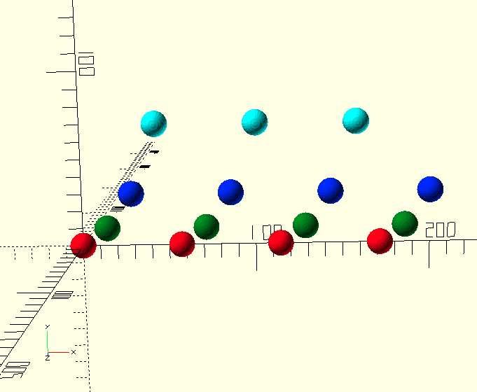  

---

### vSpread(val1,val2,...)

works similar to vRepeat, but instead of repeating the Pattern , tries to evenly Spread the PAtternamong all Elements, repeating not the whole Sequence, but every element instead, "Spreading its value among several neighbourung Pieces

```.scad
include <constructive-compiled.scad>

pieces(15) X(span(200))
  Y(vSpread(0,10,30,70))
    color(vSpread(red,green,blue,cyan))
      ball(15);
```

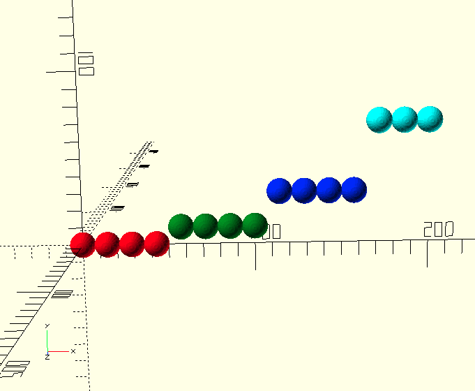  

----

#### skipFirst(n=1)

omits a command or block for the first n pieces,
consider following example:

```.scad
include <constructive-compiled.scad>

pieces(15) X(span(200))
  {
    TOUP()ball(10);

    skipFirst(10)
      box(10,h=2);  
  }
```

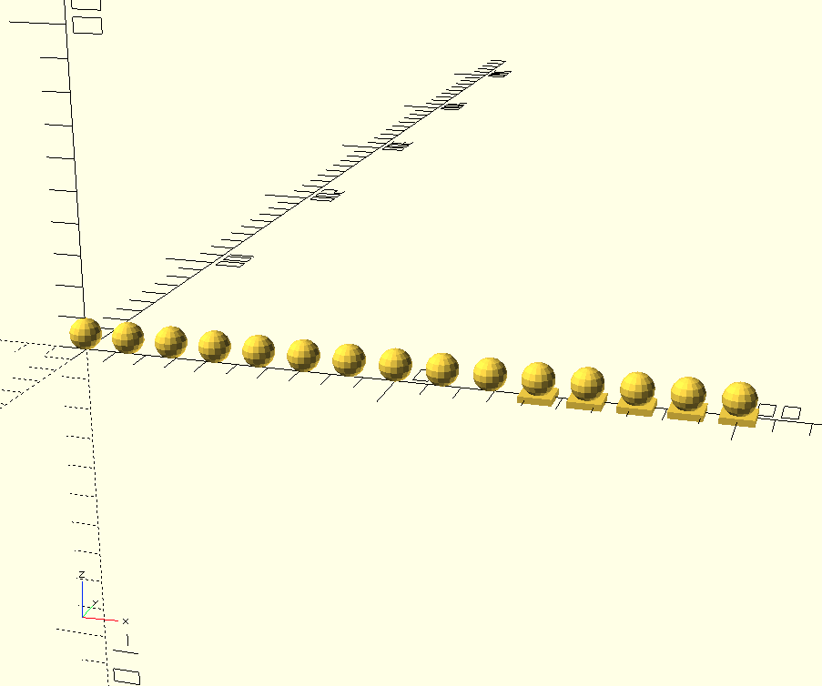  

as you can see the box() command is only run starting with 11th piece
----

----

#### ifFirst(n=1)

runs a command or block only for the first n pieces,
consider following example:

```.scad
include <constructive-compiled.scad>

pieces(15) X(span(200))
  {
    TOUP()ball(10);

    ifFirst(5)
      box(10,h=2);  
  }
```

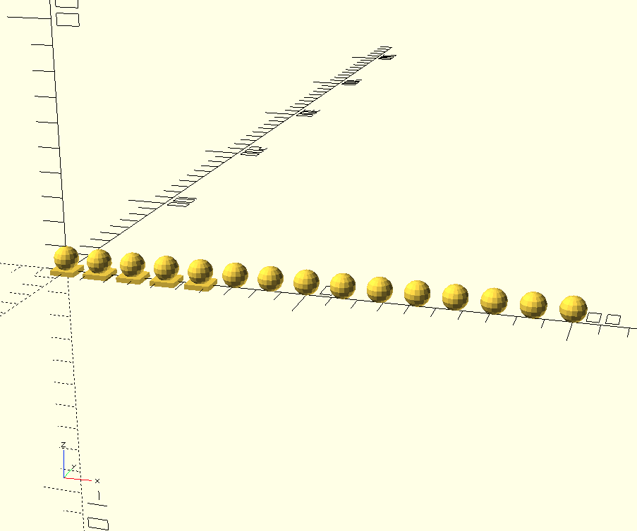  

----

#### ifLast(n=1)

runs a command or block only for the last n pieces,
consider following example:

```.scad
include <constructive-compiled.scad>

pieces(15) X(span(200))
  {
    TOUP()ball(10);

    ifLast(2)
      box(10,h=2);  
  }
```

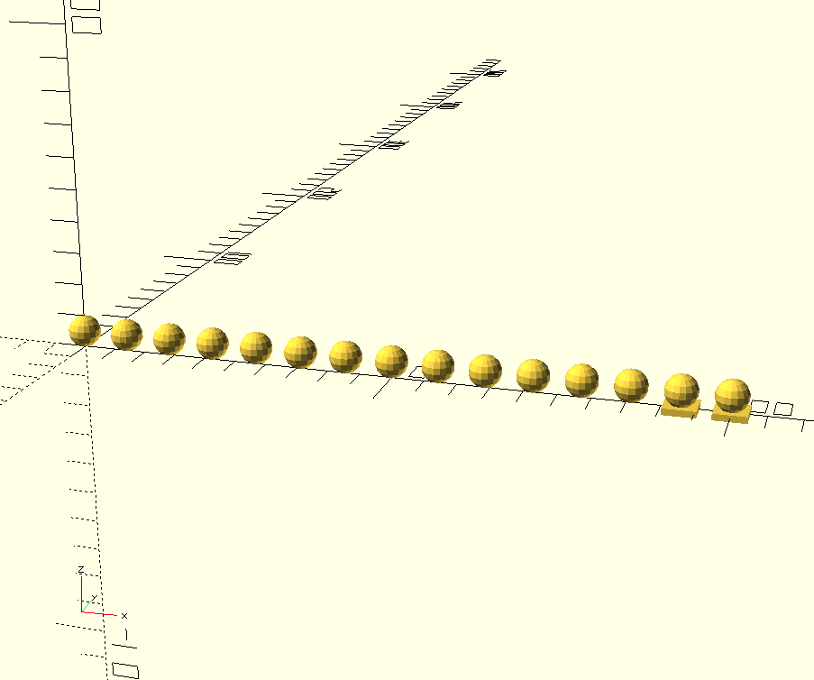  

----

#### selectPieces( decisionList =[...])

selectPieces decides for each piece to run a block on not.
it runs a block for piece number n if the coording boolean value in the decisionList[n] is true:

```.scad
include <constructive-compiled.scad>

pieces(5) X(span(200))
  {
    TOUP()ball(10);

    selectPieces([true,false,false,true])
      box(10,h=2);  
  }
```

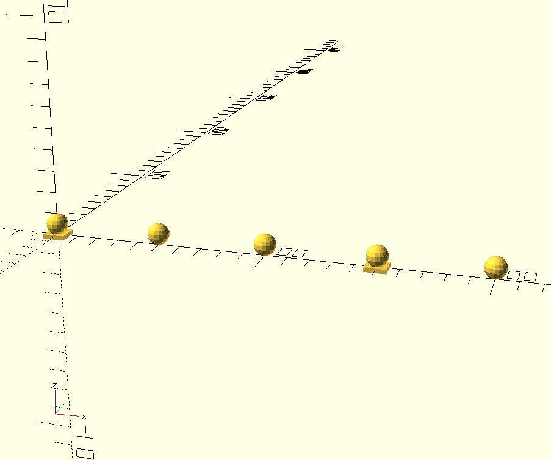  

----

### runFor(conditionList=[true]) vs pieces(n)

runFor(conditionList=[...])
works like pieces(n) but lets you select particular piece numbers to create, where pieces(n) calls its children for every number [0...n-1], runFor(conditionList=[...]) takes a list of n bool values as a parameter.
is a short for writing

```.scad
 pieces(n) selectPieces(conditionList=[...])
```

the n argument for the pieces(n) is autodetermined counting the elements in the conditionList

```.scad
include <constructive-compiled.scad>

runFor([true,false,false,true,false,true,true])
 X(span(100))
  {
    TOUP()ball(10);
    box(10,h=2);  
  }
```

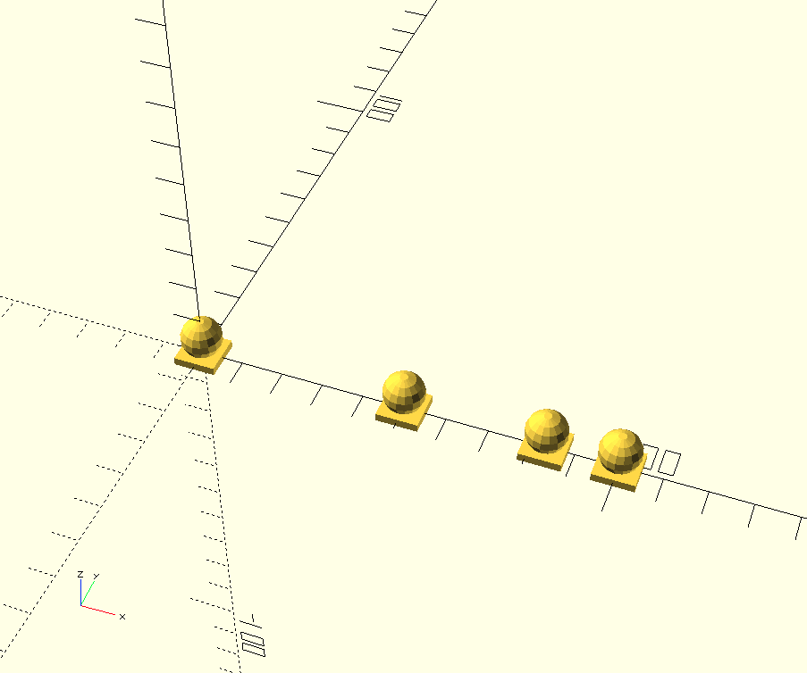
---

#### \$valPtr

\$valPtr is a Constractive system variable, which can tell you the number of the current piece in the pieces(n) body.
using it allows you to implement your own logic on how to filter or change elements, in cases vals(),sides(),selectPieces() are to cumbersome to express the conditions intent.

> in fact, behind the scenes pieces(n) is translated into vanilla OpenScad along lines of for($varPtr=[0:1:n])

```.scad
include <constructive-compiled.scad>

pieces(10)
 X(span(100))
{
  if($valPtr==3)
    ball(10);
  else if($valPtr< 3 || $valPtr >4)
    box(10,h=$valPtr*4+1);   
}
```

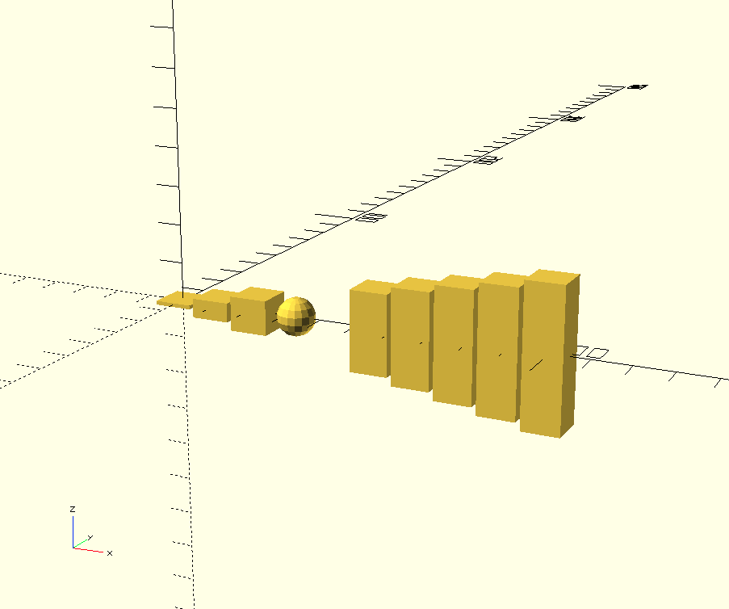  

----

----

#### removeExtra(extra=$removeExtra,what=0)

#### removeFor(body,extra=$removeExtra,what=0)

#### bodyIs(body)?(what+($removing? extra:0)):0;

#### adjustFor

####g() and height(),solid()
simple constrains(touching/distance)

###assemble()

###add()

###remove()
confineTo()

> NOTE: Due to Openscadsown issues in current versions of Openscad. confineTo can sometimes produce unpredictable results, so you might be better off uing the old goo intersection() instead, untill it is fixed

###$removing variable$

##assembling mechanical Parts from several Modules
part()

#### Additional functions and modules:

autoColor()
Opaq(color),clear(color),

###misc. 2D
arc(r,angle=90,deltaA=1,noCenter=false,wall=0)
addOffset(rOuter=1,rInner=0)
function arcPoints(r,angle=90,deltaA=1,noCenter=false)

```
if you are an experienced Openscad user, or need more information than listed here,look at the more advanced use inside examples [example](https://github.com/solidboredom/constructive/blob/main/examples/mount-demo.scad)
there is also another [example here](https://github.com/solidboredom/constructive/blob/main/examples/pulley-demo.scad)
```
